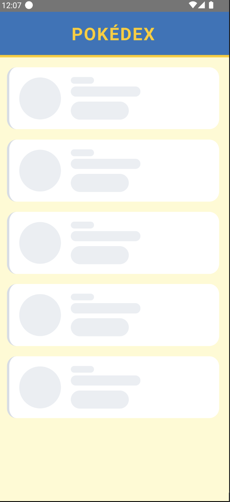
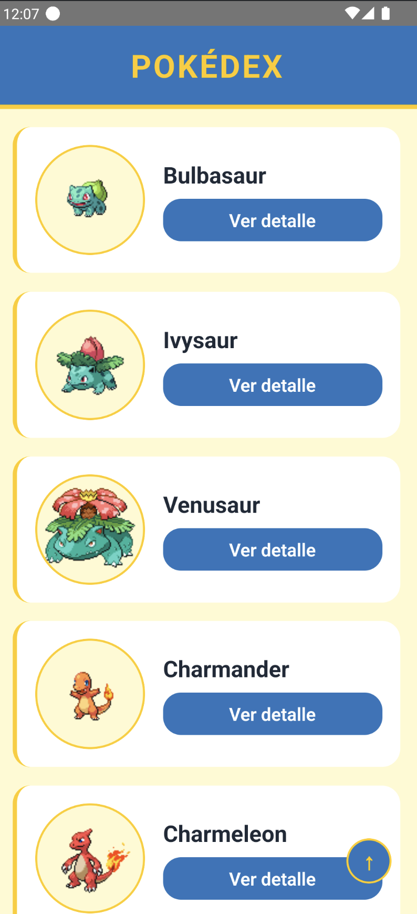
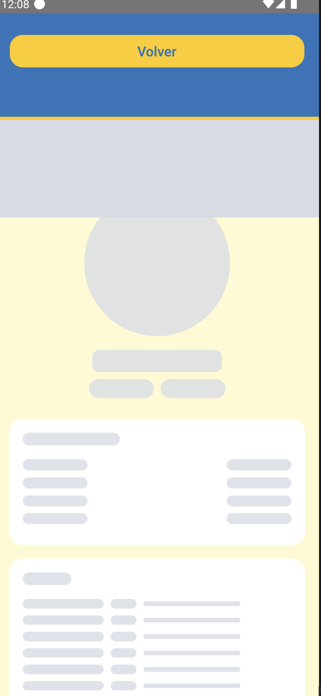
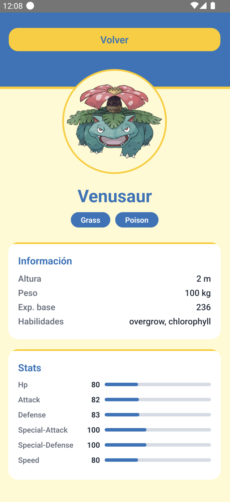

# Pokedex App

Una aplicación de Pokédex construida en **React Native** (TypeScript) siguiendo los principios de **Clean Architecture**.

---

## 🏗️ Arquitectura del Proyecto

La aplicación está dividida en capas desacopladas para garantizar el aislamiento de la lógica de negocio, facilidad de pruebas y mantenibilidad:

* **`presentation/`**: Contiene las pantallas ([ListScreen], [DetailScreen]), los componentes reutilizables, los hooks de React (View Models) y la navegación.
* **`domain/`**: Es el núcleo puro del proyecto. Define las entidades de negocio y los casos de uso independientes de cualquier framework o librería externa.
* **`data/`**: Implementa las interfaces de repositorios definidas por la capa de dominio. Gestiona la obtención de datos desde la PokeAPI a través de un cliente HTTP y maneja la persistencia de caché local en Android y iOS mediante un módulo nativo.
* **`core/di/`**: El contenedor de inyección de dependencias que conecta todas las capas del proyecto.

Para una descripción detallada, consulta el archivo [ARCHITECTURE.md](/app_pokedex/ARCHITECTURE.md).

---

## 🛠️ Requisitos Previos

- **Node.js** (versión `>= 22.11.0`)
- **Ruby** (para la gestión de dependencias de iOS a través de Bundler)
- **Android SDK** configurado junto a un emulador o dispositivo físico (para desarrollo en Android)
- **Xcode** instalado (para desarrollo en iOS, solo disponible en macOS)

---

## 🚀 Instalación y Configuración

Sigue estos pasos para instalar y configurar el proyecto localmente:

### 1. Clonar el repositorio e instalar dependencias de JavaScript
Instala las dependencias de Node.js utilizando `npm`:
```bash
npm install
```

### 2. Instalar dependencias nativas de iOS (Solo macOS)
Para configurar las dependencias nativas de iOS (CocoaPods) de forma segura y utilizando las versiones de gemas recomendadas del proyecto:

Primero, instala Bundler y las gemas del archivo `Gemfile`:
```bash
bundle install
```

Luego, instala los Pods del proyecto mediante:
```bash
bundle exec pod install --project-directory=ios
```

---

## 💻 Ejecución del Proyecto

### Paso 1: Iniciar el servidor Metro
Metro es el empaquetador de JavaScript para React Native. Inícialo en una pestaña de tu terminal:
```bash
npm start
```

### Paso 2: Compilar y ejecutar la aplicación

Abre una nueva pestaña en tu terminal y ejecuta la aplicación para la plataforma de tu elección:

#### Para Android:
```bash
npm run android
```

#### Para iOS (Solo macOS):
```bash
npm run ios
```

---

## 🔒 Seguridad RASP en Android

Esta aplicación incluye una integración de seguridad de tipo RASP (Runtime Application Self-Protection) en la capa Android.

- Se utiliza la librería `com.aheaditec.talsec.security:TalsecSecurity-Community:18.0.2`.
- El módulo `android/app/src/main/java/com/app_pokedex/SecurityManager.kt` configura detecciones de:
  - root
  - depuración dinámica
  - emulador
  - hooks dinámicos
  - manipulación de APK
- Si se detecta una amenaza, se registra con `Log.d("SECURITY_RASP", ...)` y la aplicación finaliza la tarea para proteger el entorno.

> Actualmente la integración RASP está implementada en Android y forma parte de la protección de la app en tiempo de ejecución.

---

## 🧪 Pruebas Unitarias

El proyecto cuenta con un conjunto de pruebas automatizadas escritas en **Jest** para validar la integridad de la lógica de negocio, las peticiones HTTP y el mapeo de repositorios.

Para ejecutar todas las pruebas, utiliza el siguiente comando:
```bash
npm test
```

### Cobertura de Pruebas
Las pruebas cubren los siguientes componentes críticos del sistema:
- **Uso y Renderizado de Componentes**: Prueba de renderizado inicial de [App.tsx](file:///Users/user/Desktop/study/app_pokedex/App.tsx).
- **Casos de Uso (Domain)**: Lógica de casos de uso como [GetPokemonListUseCase](file:///Users/user/Desktop/study/app_pokedex/src/domain/usecases/GetPokemonListUseCase.ts) y [GetPokemonDetailUseCase](file:///Users/user/Desktop/study/app_pokedex/src/domain/usecases/GetPokemonDetailUseCase.ts).
- **Repositores (Data)**: Pruebas sobre [PokemonRepositoryImpl](file:///Users/user/Desktop/study/app_pokedex/src/data/repositories/PokemonRepositoryImpl.ts) que validan el comportamiento de la caché temporal offline.
- **Cliente HTTP**: Aislamiento y validación de errores de conexión/red en [HttpClient](file:///Users/user/Desktop/study/app_pokedex/src/data/http/HttpClient.ts).

---

## 📸 Evidencia de Funcionamiento

A continuación se muestran capturas de pantalla del funcionamiento de la aplicación y la ejecución de la suite de pruebas unitarias:

### Interfaz de Usuario y Caché
| Vista de Lista de Pokémon | Detalle del Pokémon |
|:---:|:---:|
|  |  |

### Pruebas y Estado Offline
| Ejecución de Pruebas Unitarias (Jest) | Simulación de Caché Offline |
|:---:|:---:|
|  |  |
